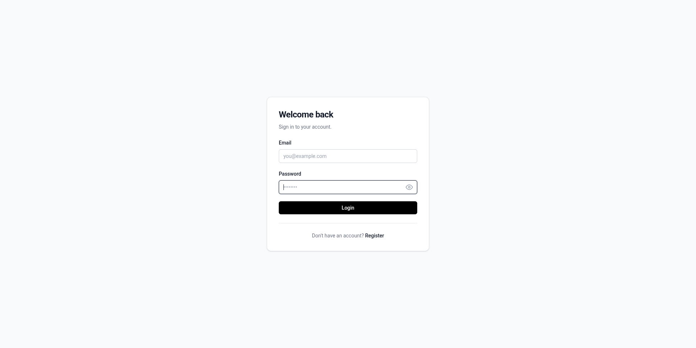
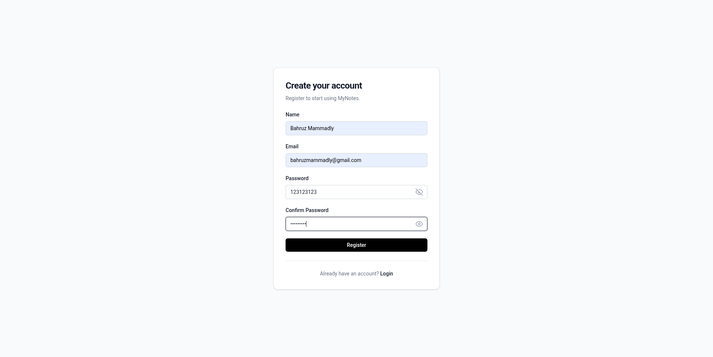
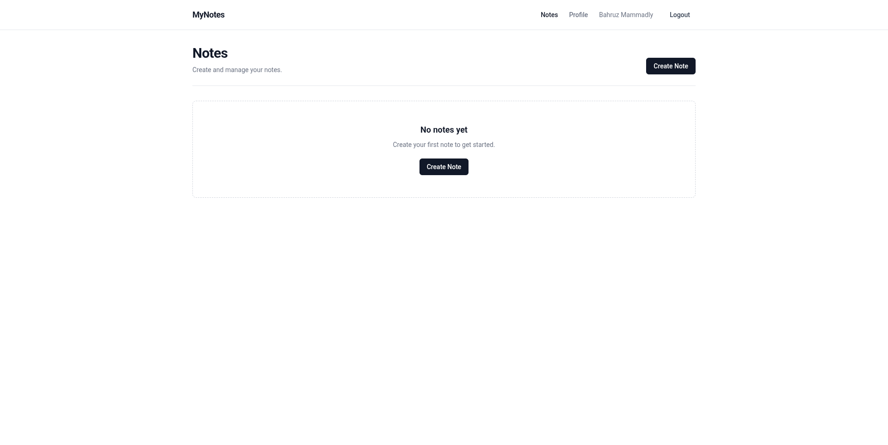
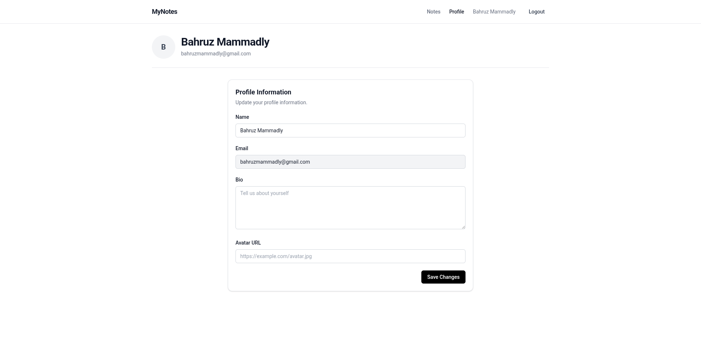

# MyNotes

A web-based note-taking application built with React, Hono, and Cloudflare D1. Create, organize, and manage your notes with ease through a modern, responsive interface.

## Overview

MyNotes is a full-stack application designed to replace traditional note-taking apps with a web-based alternative. The application supports quick note creation, categorization, pinning, archiving, and full user authentication. It provides a clean, intuitive interface for managing personal notes with real-time persistence to a serverless database.

## Demo

<p align="center">
  
  
</p>

<p align="center">
  
  
</p>

## Live Demo

Frontend: https://mynotes-react.pages.dev

API: https://mynotes-api.bahruzmammadov-dev.workers.dev/api

## Features

- User authentication with registration and login
- Create, read, update, and delete notes
- Organize notes by categories
- Pin and archive notes
- User profiles with customizable avatar and bio
- JWT-based session management
- Real-time note persistence
- Responsive design with Tailwind CSS
- Rate limiting on API endpoints

## Tech Stack

### Frontend

- React 19
- Vite
- React Router v7
- React Hook Form
- Zod (schema validation)
- Tailwind CSS
- Testing Library + Vitest

### Backend

- Hono (lightweight web framework)
- Cloudflare Workers (serverless compute)
- Cloudflare D1 (SQLite at the edge)
- bcryptjs (password hashing)
- jose (JWT handling)
- Wrangler CLI

### Database

- SQLite (via Cloudflare D1)

## Architecture

```
Frontend (React + Vite)
         ↓
   Cloudflare Pages
         ↓
API Endpoints (Hono on Cloudflare Workers)
         ↓
   Cloudflare D1 (SQLite Database)
```

## Project Structure

```
.
├── backend/
│   ├── src/
│   │   ├── app.js              # Hono app configuration
│   │   └── worker.js           # Worker entry point with Cloudflare bindings
│   ├── controllers/
│   │   ├── authController.js   # Authentication logic
│   │   ├── noteController.js   # Note CRUD operations
│   │   └── profileController.js # User profile management
│   ├── middleware/
│   │   └── authMiddleware.js   # JWT verification and protection
│   ├── models/
│   │   ├── userModel.js        # User database queries
│   │   └── noteModel.js        # Note database queries
│   ├── routes/
│   │   ├── authRoutes.js       # Auth endpoints
│   │   ├── noteRoutes.js       # Note endpoints
│   │   └── profileRoutes.js    # Profile endpoints
│   ├── migrations/
│   │   └── 0001_initial.sql    # Database schema
│   ├── scripts/
│   │   └── test-api.js         # API testing utility
│   ├── package.json
│   └── wrangler.jsonc          # Cloudflare Workers configuration
│
├── frontend/
│   ├── src/
│   │   ├── api/                # API client utilities
│   │   ├── components/         # Reusable React components
│   │   ├── context/            # React Context for auth state
│   │   ├── hooks/              # Custom React hooks
│   │   ├── pages/              # Page components (Login, Register, Notes, Profile)
│   │   ├── routes/             # Route protection and layout components
│   │   ├── test/               # Test files
│   │   ├── App.jsx
│   │   ├── main.jsx
│   │   └── index.css
│   ├── public/
│   ├── index.html
│   ├── package.json
│   ├── vite.config.js
│   └── eslint.config.js
│
└── .prettierrc                 # Code formatting configuration
```

## API

Base URL: `https://mynotes-api.bahruzmammadov-dev.workers.dev/api`

### Authentication

**Register**

```
POST /api/auth/register
Content-Type: application/json

{
  "name": "John Doe",
  "email": "john@example.com",
  "password": "securepassword"
}
```

**Login**

```
POST /api/auth/login
Content-Type: application/json

{
  "email": "john@example.com",
  "password": "securepassword"
}
```

**Get Current User**

```
GET /api/auth/me
Authorization: Bearer <token>
```

**Logout**

```
POST /api/auth/logout
Authorization: Bearer <token>
```

### Notes

All note endpoints require authentication via `Authorization: Bearer <token>` header.

**Get All Notes**

```
GET /api/notes
Authorization: Bearer <token>
```

**Get Note by ID**

```
GET /api/notes/:id
Authorization: Bearer <token>
```

**Create Note**

```
POST /api/notes
Content-Type: application/json
Authorization: Bearer <token>

{
  "title": "My Note",
  "content": "Note content here",
  "category": "work"
}
```

**Update Note (Full)**

```
PUT /api/notes/:id
Content-Type: application/json
Authorization: Bearer <token>

{
  "title": "Updated Title",
  "content": "Updated content",
  "category": "personal"
}
```

**Partial Update Note**

```
PATCH /api/notes/:id
Content-Type: application/json
Authorization: Bearer <token>

{
  "title": "New Title",
  "is_pinned": true,
  "is_archived": false
}
```

**Delete Note**

```
DELETE /api/notes/:id
Authorization: Bearer <token>
```

### Profile

**Get Profile**

```
GET /api/profile
Authorization: Bearer <token>
```

**Update Profile**

```
PUT /api/profile
Content-Type: application/json
Authorization: Bearer <token>

{
  "name": "Jane Doe",
  "bio": "Developer and note taker",
  "avatar_url": "https://example.com/avatar.jpg"
}
```

### Health

**Check API Status**

```
GET /api/health
```

## Authentication

The application uses JWT (JSON Web Tokens) for session management:

- Tokens are issued upon successful registration or login
- Tokens expire after 7 days
- Tokens are signed with HS256 algorithm
- Required format: `Authorization: Bearer <token>`
- Tokens include user ID and email claims

Passwords are hashed using bcryptjs with a salt round of 12 before storage.

## Authorization

Protected routes check for valid JWT tokens via the `protect` middleware. All note endpoints verify that the requesting user owns the resource:

- Users can only access their own notes
- Notes are filtered by user ID in database queries
- Attempting to access another user's note returns 404
- Profile updates only affect the authenticated user's record

## Validation

### Frontend

- Form validation using Zod schema validation
- React Hook Form for form state management
- Real-time field validation feedback

### Backend

- Type checking on all request payloads
- Email validation (must contain @)
- Password length requirement (minimum 8 characters)
- Name length validation (2–100 characters)
- Bio length limit (maximum 500 characters)
- Avatar URL length limit (maximum 500 characters)
- Numeric ID validation for note operations
- Trimming and lowercase normalization of email

## Security

- **JWT Authentication**: Token-based authentication with 7-day expiration
- **Password Hashing**: bcryptjs with 12 salt rounds
- **CORS**: Configured to accept requests only from the frontend URL
- **Security Headers**: HTTP security headers applied via Hono middleware
- **Parameterized Queries**: All database queries use parameter binding to prevent SQL injection
- **Ownership Verification**: Notes and profiles are tied to authenticated users via `user_id`
- **Rate Limiting**: API endpoints limited to 300 requests per 60 seconds per Cloudflare configuration
- **Authorization Middleware**: Token validation on all protected routes

## Testing

### Frontend Tests

Run tests with:

```bash
cd frontend
npm test
```

Run tests once (CI mode):

```bash
cd frontend
npm run test:run
```

Test setup includes:

- Vitest test runner
- React Testing Library
- jsdom environment
- User event simulation

Note: Test files are currently empty placeholders and are ready for implementation.

### Backend API Tests

A basic API test utility is available:

```bash
cd backend
npm run test:api
```

## Environment Variables

### Frontend (`frontend/.env`)

```
VITE_API_URL=https://mynotes-api.bahruzmammadov-dev.workers.dev/api
```

- `VITE_API_URL`: The backend API base URL for fetch requests

### Backend (`backend/.wrangler.jsonc` + secrets)

```
JWT_SECRET=<your-secret-key>
NODE_ENV=production
CLIENT_URL=https://mynotes-react.pages.dev
```

- `JWT_SECRET`: Secret key for signing JWTs (must be set in production)
- `NODE_ENV`: Environment indicator
- `CLIENT_URL`: Allowed origin for CORS requests
- `DB`: Cloudflare D1 database binding (configured in wrangler.jsonc)

## Local Development

### Prerequisites

- Node.js 18+
- npm or yarn
- Wrangler CLI for backend deployment

### Frontend Setup

```bash
cd frontend

# Install dependencies
npm install

# Start development server (http://localhost:5173)
npm run dev

# Build for production
npm run build

# Preview production build
npm run preview

# Run linter
npm run lint
```

### Backend Setup

```bash
cd backend

# Install dependencies
npm install

# Start development server with Wrangler
npm run dev

# Run with --local flag to use local D1 database
wrangler dev --local

# Deploy to Cloudflare Workers
npm run deploy
```

Both frontend and backend development servers run with hot reload enabled.

## Production Deployment

### Frontend

1. Push code to GitHub
2. Cloudflare Pages automatically builds and deploys on push
3. Build command: `npm run build` (configured in Pages)
4. Output directory: `dist/`

### Backend

1. Ensure Cloudflare Workers account is set up
2. Configure `wrangler.jsonc` with your Cloudflare project details
3. Deploy with:
    ```bash
    cd backend
    wrangler deploy
    ```
4. Set production secrets:
    ```bash
    wrangler secret put JWT_SECRET
    ```

### Database

Cloudflare D1 is automatically provisioned and managed:

- Database name: `mynotes-db`
- Migration file: `backend/migrations/0001_initial.sql`
- Migrations run automatically on first deployment

## Database

The application uses SQLite via Cloudflare D1 with two main tables:

**users**

- `id` (INTEGER, primary key)
- `name` (TEXT)
- `email` (TEXT, unique)
- `password_hash` (TEXT)
- `avatar_url` (TEXT, optional)
- `bio` (TEXT, optional)
- `created_at` (DATETIME)
- `updated_at` (DATETIME)

**notes**

- `id` (INTEGER, primary key)
- `user_id` (INTEGER, foreign key → users.id)
- `title` (TEXT)
- `content` (TEXT)
- `category` (TEXT, default: "general")
- `is_pinned` (INTEGER, default: 0)
- `is_archived` (INTEGER, default: 0)
- `created_at` (DATETIME)
- `updated_at` (DATETIME)

Notes are sorted by pinned status (descending), then by update time (descending).

## Production Status

The application is deployed and available for use:

- Frontend is live at https://mynotes-react.pages.dev
- Backend API is live at https://mynotes-api.bahruzmammadov-dev.workers.dev/api
- Database is configured on Cloudflare D1
- Rate limiting is enabled (300 requests per 60 seconds)

Core features are functional: authentication, note CRUD, profile management, and categorization.
